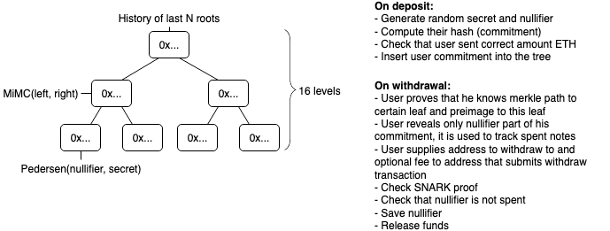
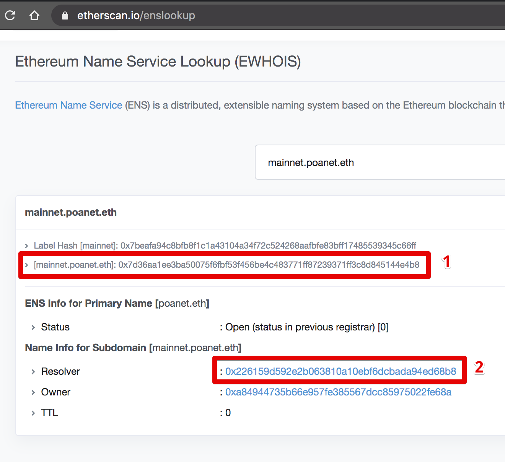
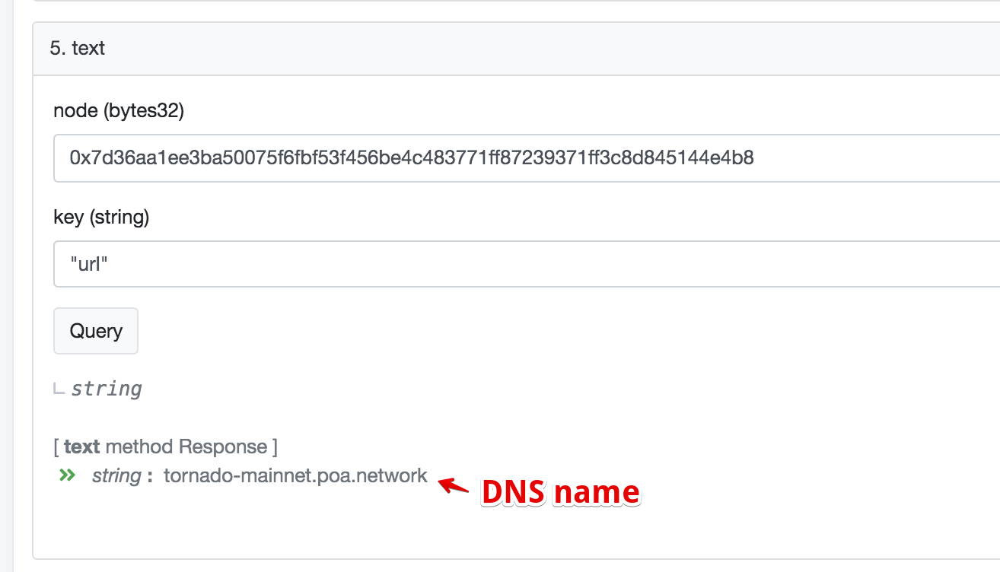

# Tornado Cash Privacy Solution _(bumped up for ETH Taipei)_

<details>
    <summary>Click here for Tornado Cash's original readme</summary>
Tornado Cash is a non-custodial Ethereum and ERC20 privacy solution based on zkSNARKs. It improves transaction privacy by breaking the on-chain link between the recipient and destination addresses. It uses a smart contract that accepts ETH deposits that can be withdrawn by a different address. Whenever ETH is withdrawn by the new address, there is no way to link the withdrawal to the deposit, ensuring complete privacy.

To make a deposit user generates a secret and sends its hash (called a commitment) along with the deposit amount to the Tornado smart contract. The contract accepts the deposit and adds the commitment to its list of deposits.

Later, the user decides to make a withdrawal. To do that, the user should provide a proof that he or she possesses a secret to an unspent commitment from the smart contract’s list of deposits. zkSnark technology allows that to happen without revealing which exact deposit corresponds to this secret. The smart contract will check the proof and transfer deposited funds to the address specified for withdrawal. An external observer will be unable to determine which deposit this withdrawal came from.

You can read more about it in [this Medium article](https://medium.com/@tornado.cash/introducing-private-transactions-on-ethereum-now-42ee915babe0)

## Specs

- Deposit gas cost: 1088354 (43381 + 50859 \* tree_depth)
- Withdraw gas cost: 301233
- Circuit Constraints = 28271 (1869 + 1325 \* tree_depth)
- Circuit Proof time = 10213ms (1071 + 347 \* tree_depth)
- Serverless



## Whitepaper

**[TornadoCash_whitepaper_v1.4.pdf](https://tornado.cash/audits/TornadoCash_whitepaper_v1.4.pdf)**

## Was it audited?

Tornado.cash protocols, circuits, and smart contracts were audited by a group of experts from [ABDK Consulting](https://www.abdk.consulting), specializing in zero-knowledge, cryptography, and smart contracts.

During the audit, no critical issues were found and all outstanding issues were fixed. The results can be found here:

- Cryptographic review https://tornado.cash/audits/TornadoCash_cryptographic_review_ABDK.pdf
- Smart contract audit https://tornado.cash/audits/TornadoCash_contract_audit_ABDK.pdf
- Zk-SNARK circuits audit https://tornado.cash/audits/TornadoCash_circuit_audit_ABDK.pdf

Underlying circomlib dependency is currently being audited, and the team already published most of the fixes for found issues

## Requirements

1. `node v11.15.0`
2. `npm install -g npx`

## Usage

You can see example usage in cli.js, it works both in the console and in the browser.

1. `npm install`
1. `cp .env.example .env`
1. `npm run build` - this may take 10 minutes or more
1. `npx ganache-cli`
1. `npm run test` - optionally runs tests. It may fail on the first try, just run it again.

Use browser version on Kovan:

1. `vi .env` - add your Kovan private key to deploy contracts
1. `npm run migrate`
1. `npx http-server` - serve current dir, you can use any other static http server
1. Open `localhost:8080`

Use the command-line version. Works for Ganache, Kovan, and Mainnet:

### Initialization

1. `cp .env.example .env`
1. `npm run download`
1. `npm run build:contract`

### Ganache

1. make sure you complete steps from Initialization
1. `ganache-cli -i 1337`
1. `npm run migrate:dev`
1. `./cli.js test`
1. `./cli.js --help`

### Kovan, Mainnet

1. Please use https://github.com/tornadocash/tornado-cli
   Reason: because tornado-core uses websnark `2041cfa5fa0b71cd5cca9022a4eeea4afe28c9f7` commit hash in order to work with local trusted setup. Tornado-cli uses `4c0af6a8b65aabea3c09f377f63c44e7a58afa6d` commit with production trusted setup of tornadoCash

Example:

```bash
./cli.js deposit ETH 0.1 --rpc https://kovan.infura.io/v3/27a9649f826b4e31a83e07ae09a87448
```

> Your note: tornado-eth-0.1-42-0xf73dd6833ccbcc046c44228c8e2aa312bf49e08389dadc7c65e6a73239867b7ef49c705c4db227e2fadd8489a494b6880bdcb6016047e019d1abec1c7652
> Tornado ETH balance is 8.9
> Sender account ETH balance is 1004873.470619891361352542
> Submitting deposit transaction
> Tornado ETH balance is 9
> Sender account ETH balance is 1004873.361652048361352542

```bash
./cli.js withdraw tornado-eth-0.1-42-0xf73dd6833ccbcc046c44228c8e2aa312bf49e08389dadc7c65e6a73239867b7ef49c705c4db227e2fadd8489a494b6880bdcb6016047e019d1abec1c7652 0x8589427373D6D84E98730D7795D8f6f8731FDA16 --rpc https://kovan.infura.io/v3/27a9649f826b4e31a83e07ae09a87448 --relayer https://kovan-frelay.duckdns.org
```

> Relay address: 0x6A31736e7490AbE5D5676be059DFf064AB4aC754
> Getting current state from tornado contract
> Generating SNARK proof
> Proof time: 9117.051ms
> Sending withdraw transaction through the relay
> Transaction submitted through the relay. View transaction on etherscan https://kovan.etherscan.io/tx/0xcb21ae8cad723818c6bc7273e83e00c8393fcdbe74802ce5d562acad691a2a7b
> Transaction mined in block 17036120
> Done

## Deploy ETH Tornado Cash

1. `cp .env.example .env`
1. Tune all necessary params
1. `npx truffle migrate --network kovan --reset --f 2 --to 4`

## Deploy ERC20 Tornado Cash

1. `cp .env.example .env`
1. Tune all necessary params
1. `npx truffle migrate --network kovan --reset --f 2 --to 3`
1. `npx truffle migrate --network kovan --reset --f 5`

**Note**. If you want to reuse the same verifier for all the instances, then after you deployed one of the instances you should only run the 4th or 5th migration for ETH or ERC20 contracts respectively (`--f 4 --to 4` or `--f 5`).

## How to resolve ENS name to DNS name for a relayer

1. Visit https://etherscan.io/enslookup and put relayer ENS name to the form.
2. Copy the namehash (1) and click on the `Resolver` link (2)
   
3. Go to the `Contract` tab. Click on `Read Contract` and scroll down to the `5. text` method.
4. Put the values:
   
5. Click `Query` and you will get the DNS name. Just add `https://` to it and use it as `relayer url`

## Credits

Special thanks to @barryWhiteHat and @kobigurk for valuable input,
and @jbaylina for awesome [Circom](https://github.com/iden3/circom) & [Websnark](https://github.com/iden3/websnark) framework

## Minimal demo example

1. `npm i`
1. `ganache-cli -d`
1. `npm run download`
1. `npm run build:contract`
1. `cp .env.example .env`
1. `npm run migrate:dev`
1. `node minimal-demo.js`

## Run tests/coverage

Prepare test environment:

```
   yarn install
   yarn download
   cp .env.example .env
   npx ganache-cli > /dev/null &
   npm run migrate:dev
```

Run tests:

```
   yarn test
```

Run coverage:

```
   yarn coverage
```

## Emulate MPC trusted setup ceremony

```bash
cargo install zkutil
npx circom circuits/withdraw.circom -o build/circuits/withdraw.json
zkutil setup -c build/circuits/withdraw.json -p build/circuits/withdraw.params
zkutil export-keys -c build/circuits/withdraw.json -p build/circuits/withdraw.params -r build/circuits/withdraw_proving_key.json -v build/circuits/withdraw_verification_key.json
zkutil generate-verifier -p build/circuits/withdraw.params -v build/circuits/Verifier.sol
sed -i -e 's/pragma solidity \^0.6.0/pragma solidity 0.5.17/g' ./build/circuits/Verifier.sol
```
</details>

This hackathon project seeks to simplify Tornado Cash's setup so that it uses `Foundry` instead of the deprecated `Truffle` framework.

## Setup

Install the dependencies:

```bash
forge install
yarn install
```

and build the project:

```bash
npm run build
```

>[!NOTICE]
> Here, the build instances for the circuits, along with the verification keys, are already given from the original Tornado Cash project. Due to circom compiler in js deprecation, building this ourselves may break the project. One reason may be that the `Verifier.sol` created will be different. For the sake of reproducibility, we will keep the original builds for circuits and keys.

## Test

The project includes _basic_ tests in the `foundry_tests/` directory. To view the power of tornado cash in action, open another terminal and spin up an anvil instance:

```bash
anvil
```

resulting in

```bash
                             _   _
                            (_) | |
      __ _   _ __   __   __  _  | |
     / _` | | '_ \  \ \ / / | | | |
    | (_| | | | | |  \ V /  | | | |
     \__,_| |_| |_|   \_/   |_| |_|

    1.0.0-stable (e144b82070 2025-02-13T20:02:34.979686000Z)
    https://github.com/foundry-rs/foundry

Available Accounts
==================

(0) 0xf39Fd6e51aad88F6F4ce6aB8827279cffFb92266 (10000.000000000000000000 ETH)
(1) 0x70997970C51812dc3A010C7d01b50e0d17dc79C8 (10000.000000000000000000 ETH)
...

Private Keys
==================

(0) 0xac0974bec39a17e36ba4a6b4d238ff944bacb478cbed5efcae784d7bf4f2ff80
(1) 0x59c6995e998f97a5a0044966f0945389dc9e86dae88c7a8412f4603b6b78690d
...

Chain ID
==================

31337

...

Listening on 127.0.0.1:8545
```

### Deployments

To fully test Tornado cash, we'll need to deploy a mock ERC20 (this will allow us to deploy and test the tornado cash implementation with ERC20s too). We can do this directly with `forge create`:

```bash
forge create contracts/Mocks/ERC20Mock.sol:ERC20Mock --broadcast --rpc-url <RPC_URL> --private-key <PRIVATE_KEY>
```

_Note that when testing with anvil, we'd be using `127.0.0.1:8545` as endpoint and any private key provided by `anvil`._

_Also note that, when using these scripts to deploy to non-testnets, it is preferred for security reasons to use `--interactives 1` rather than `--private-key <PRIVATE_KEY>`_.

With the resulting ERC20 address (`<ERC20_ADDRESS>`), we can now fully deploy a set of Tornado Cash instances by running the `Deploy.s.sol` script:

```bash
forge script foundry_scripts/Deploy.s.sol \
--sig "run(address[],uint256[])" \
"[<ERC20_ADDRESS>,<ERC20_ADDRESS>,<ERC20_ADDRESS>]" \
"[1000000000000000000,10000000000000000000,100000000000000000000]" \
--broadcast \
--rpc-url <RPC_URL> \
--private-key <PRIVATE_KEY>
```

resulting in the following output:

```bash
== Logs ==
  -> Verifier deployed at <VERIFIER_ADDRESS>
  -> Hasher deployed at <HASHER_ADDRESS>
  -> Tornado 1 * 0.1 ETH deployed at: <ETH_TORNADO_ADDRESS_1>
  -> Tornado 10 * 0.1 ETH deployed at: <ETH_TORNADO_ADDRESS_2>
  -> Tornado 100 * 0.1 ETH deployed at: <ETH_TORNADO_ADDRESS_3>
  -> Tornado 1000 * 0.1 ETH deployed at: <ETH_TORNADO_ADDRESS_4>
  -> Tornado with denomination of 1000000000000000000 for ERC20 address <ERC20_ADDRESS> deployed at <ERC20_TORNADO_ADDRESS_1>
  -> Tornado with denomination of 10000000000000000000 for ERC20 address <ERC20_ADDRESS> deployed at <ERC20_TORNADO_ADDRESS_2>
  -> Tornado with denomination of 100000000000000000000 for ERC20 address <ERC20_ADDRESS> deployed at <ERC20_TORNADO_ADDRESS_3>
```

_Note that the `Verifier` and `Hasher` are necessary for all the instances to work (and only need to be deployed one time)_. 

### Interacting with Tornado instances

The original Tornado Cash project came with a `cli` script to interact with the Tornado instances. Here, we modified the script so that it works with the latest broadcast instances.

First we need to create a data structure that contains the Tornado addresses and their denominations. To obtain that, run:

```bash
npm run parseDeployments
```

which results in

```bash
File written to ethglobal-taipei/src/anvil_config.js
```

containing the data needed by `src/cli.js` to run properly.

#### Depositing into Tornado

Copy `.example.env` into `.env` and fill in the private key of the account that is going to deposit the funds. Next, run

```bash
npm run deposit eth <DENOMINATION> --rpc <RPC_URL>
```

which creates a deposit of the amount ETH specified by `<DENOMINATION>` and creates the corresponding note. Take into account that in this guide, we have only deployed tornados for the following denominations of ETH: `0.1`, `1`, `10` and `100`. If the `--quiet` flag is not provided, an output similar to the following is shown (_here we chose 0.1 as denomination_):

```bash
Your note: tornado-eth-0.1-31337-0xd7f3b09fc52c4ae50916560ffd29d0bf277edb242b91453efba6d0142f1e7594df8a7ec6431eb31c91cb964916e29638068b9f1db42bc0e74b2fa7db9b3d
Tornado ETH balance is 0
Sender account ETH balance is 9999.981639925142638153
Amount: 0.1
Value: 100000000000000000
Tornado: 0xCf7Ed3AccA5a467e9e704C703E8D87F634fB0Fc9
Tornado ETH balance is 0.1
Sender account ETH balance is 9999.880127263981720901
```

To deposit an ERC20, the procedure is similar:

```bash
npm run deposit <ERC20_ADDRESS> <DENOMINATION> --rpc <RPC_URL>
```

and example with the deployed `MockERC20` and a denomination of `10000000000000000000` would result in the following output:

```bash
Your note: tornado-0x5fbdb2315678afecb367f032d93f642f64180aa3-10000000000000000000-31337-0x5755aea1746f6ca05c420f26e2ed7b4887aebba1583051a12693fa756950f2a2c5883febad091f98676c8b58a965f2d7de1b72db78e57acd0913a19d91db
Tornado Token Balance is 0
Sender account Token Balance is 0
Minting some test tokens to deposit // THIS OCCURS BECAUSE OUR MOCK ERC20 IS DESIGNED TO MINT TOKENS IF THE DEPOSITOR HAS A BALANCE OF 0
Current allowance is 0
Approving tokens for deposit
Submitting deposit transaction
Tornado Token Balance is 10
Sender account Token Balance is 0
```

Record the notes as they are the only way to withdraw the funds deposited in Tornado.

#### Withdrawing funds from Tornado

For the withdrawal, we will only need an aforementioned (unspent) note and a destination address. The writhdrawal is triggered by running:

```bash
npm run withdraw <NOTE> <DESTINATION_ADDRESS> --rpc <RPC_URL>
```

(_To ensure privacy, change the private key specified in the .env file_).

If the `--quiet` flag is not provided, it will result in an output similar to this:

```bash
Getting current state from tornado contract
Generating SNARK proof
Proof time: 2.719s
Submitting withdraw transaction
The transaction hash is ...
Done
```

The procedure is exactly the same for ERC20 withdrawals.